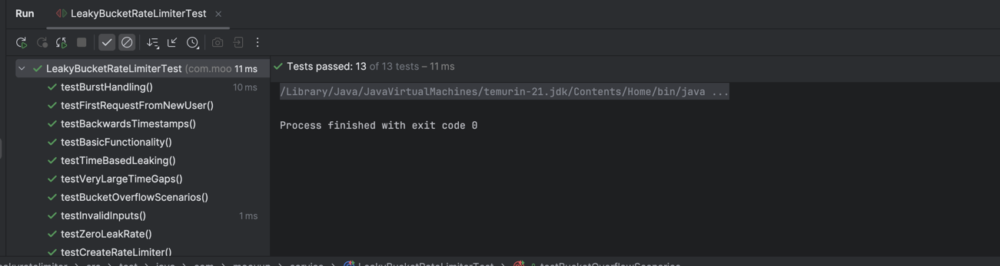

## Deliverables
* Core implementation of the three required functions
    * LeakyBucketRateLimiter have the core functionality
        1. createRateLimiter
      2. allowRequest
      3. getBucketState

* Test cases demonstrating correctness across key scenarios
  * App.java have the following methods to demonstrate the key scenarios
  1. Basic Usage of Rate Limiter
  2. Burst Handling of Rate Limiter
  3. Time based Leaking of Rate Limiter
  4. Multiple User of Rate Limiter
  5. Other test and edge cases covered in the Unit Test
  

* Brief explanation of your design decisions and trade-offs
### Design Descision
* SOLID principle
* Per User Isolation
* Scalability - Supports unlimited number of users
* Thread Safety - Concurrent hashmap for concurrent access
* Continuous Leaking - Smooth rate limiting behavior
* Time-based Accuracy - Precise leak calculations 
* Burst Handling - Natural burst tolerance up to capacity

 ### Trade-offs:
* Time Dependency - Requires accurate timestamp management
* Clock Synchronization - Sensitive to system clock changes
* Memory Growth - Memory usage grows with user count
* No Cleanup - Inactive users remain in memory indefinitely
* Performance Cost - Object creation and copying overhead
* GC Pressure - More objects for garbage collection


* Source code must be stored in a git repository (github /gitlab / bitbucket)
  https://github.com/thiyagu86k/leakyratelimiter

### How to Run This Project

* Use any IDE of your choice. This project is built using Maven, and no third-party libraries were used. Just build and run this application from the App.java file directly.

* I have already set the capacity to 3.0 and the leak rate to 1.0.

* Here, I have added the test cases for:

1) Basic Usage
2) Burst Handling
3) Time-Based Leaking
4) Multiple Users
5) Final Bucket State for Each User

### Output:

```shell
$ mvn clean install

Leaky Bucket Rate Limiter
=========================

Configuration:
- Bucket Capacity: 3.0
- Leak Rate: 1.0 units/second

Basic Usage
============
Request 1: ALLOWED
   Bucket level: 1.0/3.0
Request 2: ALLOWED
   Bucket level: 2.0/3.0
Request 3: ALLOWED
   Bucket level: 3.0/3.0
Request 4: REJECTED

Burst Handling
==============
Sending 5 rapid requests at time=0:
Request 1: ALLOWED (level: 1.0)
Request 2: ALLOWED (level: 2.0)
Request 3: ALLOWED (level: 3.0)
Request 4: REJECTED
Request 5: REJECTED

Time based Leaking
==================
Filling bucket at time=0:
Bucket full: 3.0/3.0

Request at time=1.0: ALLOWED
   Bucket level: 3.0 (leaked 1.0 units)
Request at time=2.0: ALLOWED
   Bucket level: 3.0 (leaked 1.0 units)
Request at time=5.0: ALLOWED
   Bucket level: 1.0 (leaked 3.0 units)

Multiple Users
==============
User 'raja' requests:
  Request 1: ALLOWED (level: 1.0)
  Request 2: ALLOWED (level: 2.0)
User 'nitheesh' requests:
  Request 1: ALLOWED (level: 1.0)
  Request 2: ALLOWED (level: 2.0)
User 'agila' requests:
  Request 1: ALLOWED (level: 1.0)
  Request 2: ALLOWED (level: 2.0)

Final bucket states:
  raja: 2.0/3.0
  nitheesh: 2.0/3.0
  agila: 2.0/3.0

```

### Run the Test Cases

